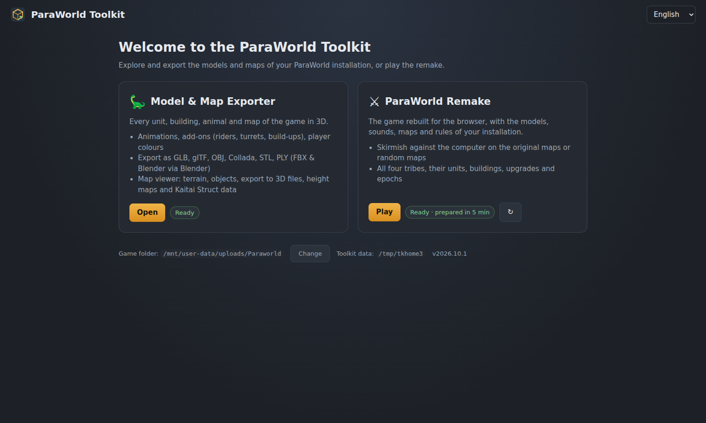
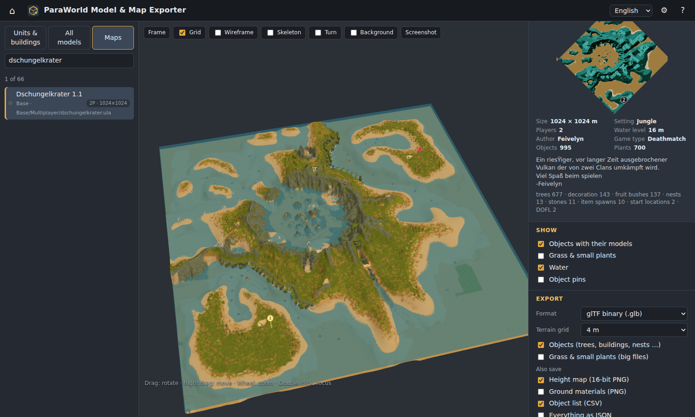
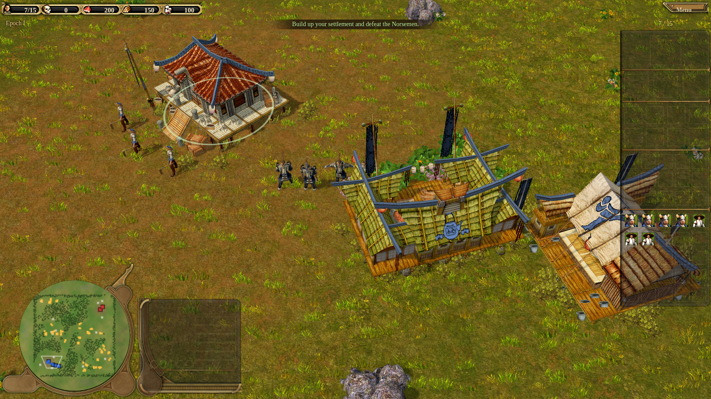

# ParaWorld Toolkit

Community tools for **ParaWorld** (SEK / Sunflowers, 2006) in one launcher:

* **Model & Map Exporter** – every unit, building, animal and map of the game in 3D, with animations, add-ons and
  player colours; export to GLB, glTF, OBJ, Collada, STL, PLY (FBX, .blend, USD and Alembic with Blender), maps to 3D
  files, height maps and raw data with [Kaitai Struct](https://kaitai.io) descriptions of the map format.
* **ParaWorld Remake** – the game rebuilt for the web browser: skirmish against the computer with all four tribes on
  the original maps or random maps, with the rules, models, sounds and interface of your installation.



**No game files are included.** You need your own copy of ParaWorld installed: the toolkit asks where it is and
reads everything from there – the exporter on the fly, the remake once on its first start (it converts what it needs
into the toolkit's own data folder). Nothing is uploaded anywhere: the toolkit is a small local web server that only
listens on your computer.

---

## Quick start

1. Install **Python 3.8 or newer** from <https://www.python.org/downloads/> (free). On Windows tick
   **"Add python.exe to PATH"** in the installer.
2. Download the toolkit (*Code → Download ZIP* on GitHub, or `git clone`) and unpack it anywhere.
3. Start it:
   * Windows: double-click **`Start ParaWorld Toolkit.bat`**
   * Linux / macOS: run `./start.sh` in a terminal

   The first start installs two small helper packages (`numpy` and `pillow`) – this needs an internet connection
   once. The launcher then opens in your web browser. Keep the console window open while you use the toolkit; close
   it to quit.
4. Tell the launcher where ParaWorld is installed (the folder that contains `Data`). Found installations are
   offered; **Browse…** opens a folder dialog.
5. Pick a tool:
   * **Model & Map Exporter → Open**. The very first start reads the model archives' tables of contents (10–30 s).
   * **ParaWorld Remake → Prepare the game data** (first time only, about 5–15 minutes: it converts the models,
     textures, interface and rules of your installation), then **Play**.

Settings, caches and the remake's game data are kept in `%APPDATA%\ParaWorldToolkit` (Linux/macOS:
`~/.config/paraworld-toolkit`); set the environment variable `PWTOOLKIT_HOME` to keep them somewhere else.
`python -m toolkit --port 8420 --no-browser` starts the server without opening a browser.

## Model & Map Exporter



* Explorer for every unit, animal, vehicle, ship, hero and building of the four tribes and the wildlife (search in
  English, German and every language your game has), plus all ~4000 models of every archive.
* Add-ons as the game scripts assemble them: riders and gunners, turrets, build-ups, drawbars and wagons, level flags,
  weapons per level, worker tools, carried goods. Model parts: saddles, armour, wounds, construction and damage
  stages, epochs, night lights, player colour. Every animation, add-on animations included.
* Maps: terrain with the setting's ground materials, the sea, every placed object with its model; export as 3D file,
  height map, material map, object list (CSV), JSON, preview picture, unpacked map data plus Kaitai Struct
  descriptions (`pwexport/data/ksy/paraworld_ula.ksy`, `paraworld_surf.ksy`).
* Command line for scripts and batch exports (`python -m pwexport.cli`, `python -m pwexport.ula`).

The full guide with a tutorial: **[docs/EXPORTER.md](docs/EXPORTER.md)**.

## ParaWorld Remake



A browser remake built from the original game's data: the original tech tree (BoosterPack 1) evaluated at runtime,
the original server scripts' rules (special moves, auras, the army pyramid, epochs, walls, harbours and fleets,
nests), the computer opponent for every tribe, the original maps, sounds, music, menus and interface art.

* Start a skirmish from the title screen: your tribe, the computer's tribe and difficulty, a random jungle map or one
  of the maps of your installation (maps you install into the game appear by themselves).
* **Debug mode** (skirmish option): everything is free and instant for you, building requirements included.
* Controls follow the original: left click selects, right click orders, drag to box-select, `Ctrl+1–9` groups,
  the mouse wheel zooms, `Esc` opens the menu.

How it is built: [remake/docs/ARCHITECTURE.md](remake/docs/ARCHITECTURE.md),
[DATA_PIPELINE.md](remake/docs/DATA_PIPELINE.md), [GAMEPLAY_RULES.md](remake/docs/GAMEPLAY_RULES.md),
[MODDING.md](remake/docs/MODDING.md) and the rules extracted from the original scripts in
[remake/docs/spec](remake/docs/spec).

## What is in this repository

```
Start ParaWorld Toolkit.bat, start.sh   start the launcher
toolkit/        the launcher: local web server (exporter + remake), first-start setup, remake data build
pwexport/       the Model & Map Exporter and the game-file readers shared by everything
                (GSF models, tech tree, texts, maps, ground textures, Kaitai descriptions in data/ksy)
remake/         the remake: src/ (game code), game/ (bundled: index.html + game.js), pipeline/ (builds the game
                data from an installation), tests/, docs/
docs/           exporter guide, file format notes (GSF models, .ula maps, composites), screenshots
tools/          development helpers: headless UI test, Kaitai description checker, script data mining
```

## For developers

* **Python** (toolkit, exporter, remake pipeline): only `numpy` and `pillow`. Everything runs from the repository
  folder, no install step.
* **Remake code**: `cd remake && npm install && npm run build` bundles `src/` into `game/game.js` with esbuild
  (three.js is bundled; the built `game/` is committed so players need no Node.js).
* **Remake game data by hand**: `python -m remake.pipeline <ParaWorld folder> <output folder> [steps]`.
* **Tests**: `python remake/devserver.py --game <ParaWorld folder>` serves the remake alone on port 8411;
  `remake/tests/regress.sh` runs the game tests (headless Chromium via Playwright), `tools/ui_test.py` the toolkit's
  UI, `tools/ksy_check.py` checks the Kaitai descriptions against map files.
* The remake is object-oriented: entity classes (`Unit`, `Building`, `ResNode`, `Projectile`) with their own state,
  and the rules as *systems* (`remake/src/game/systems/*.js`) mixed into the `World`. Most numbers come from the
  original tech tree; behaviour lives in small tables (moves, composites, rules) that are easy to edit.

Contributions welcome – keep game files out of commits (`.gitignore` blocks the usual ones).

## Credits

* GSF model format research: **Zidell** (the GSF documentation) and **arceusVen1**'s
  [Paraworld_gsf_viewer](https://github.com/arceusVen1/Paraworld_gsf_viewer) (with its `gsf.ksy`) – thank you!
* The ParaWorld community at [para-welt.com](https://para-welt.com) for the script documentation.
* [three.js](https://threejs.org) (MIT license; `pwexport/web/vendor/three`, and bundled into `remake/game/game.js`),
  [esbuild](https://esbuild.github.io), [Kaitai Struct](https://kaitai.io).
* ParaWorld © SEK / Sunflowers / Ubisoft. This project is an unofficial fan work; it contains no files of the game
  and only reads the files of your own copy. Models, textures, sounds and texts stay the property of their owners.

## License

**[The Unlicense](LICENSE)** – public domain. Use it, change it, copy it, sell it, put it in your own project, with
or without credit.
