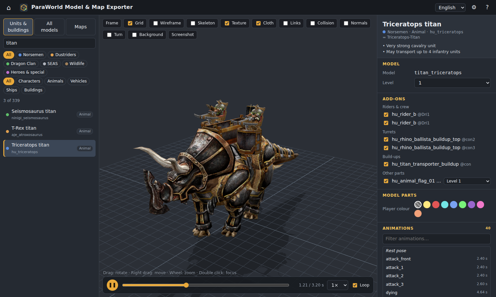
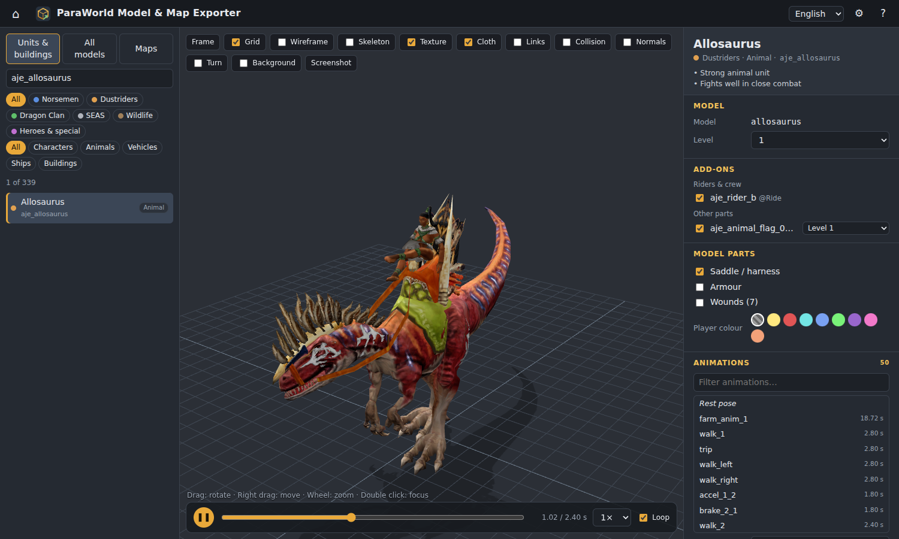
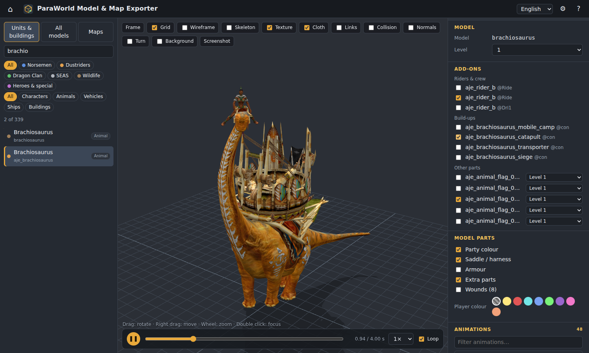
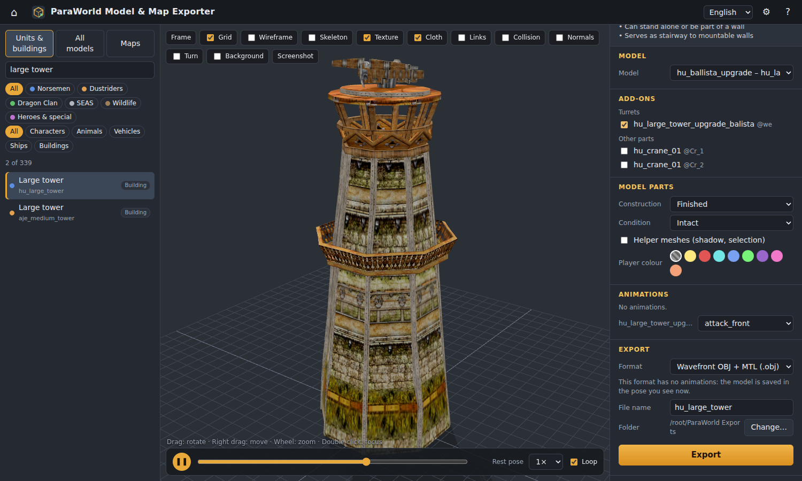
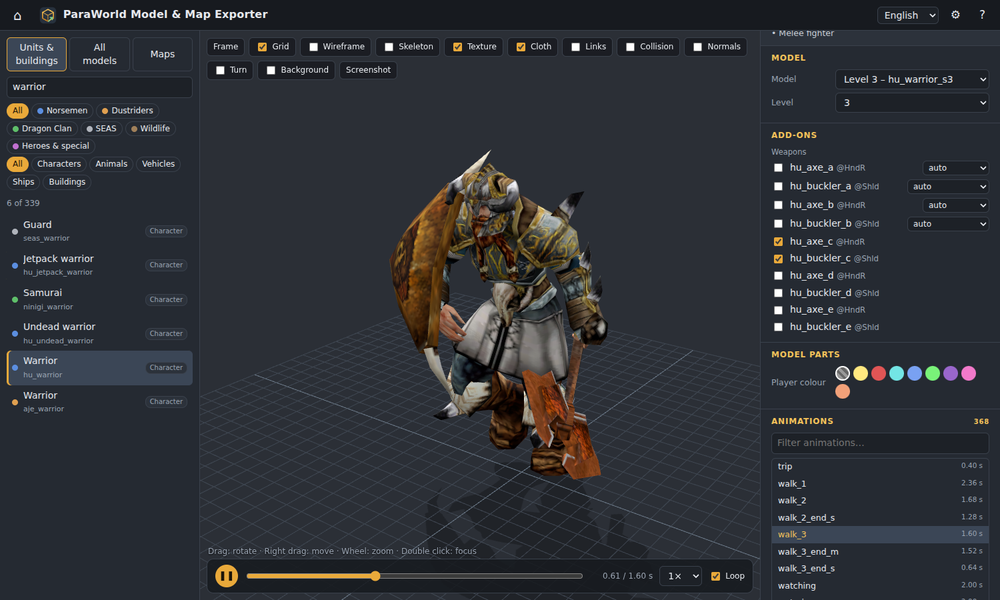
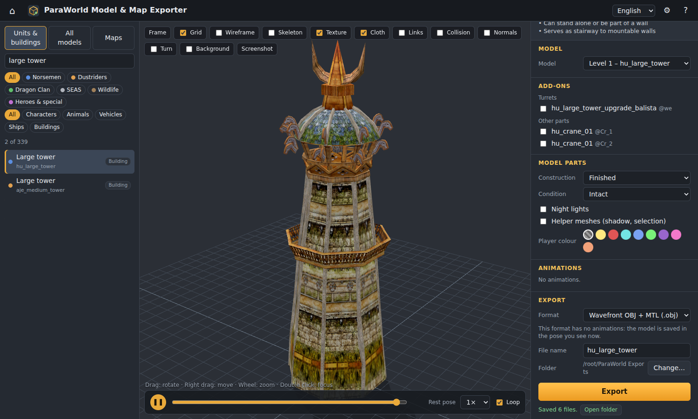
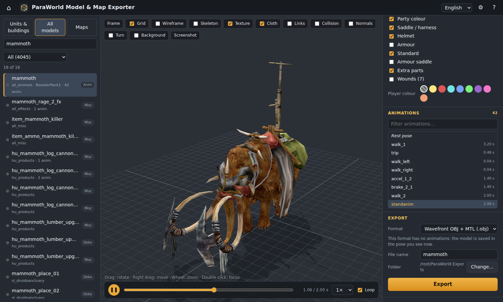
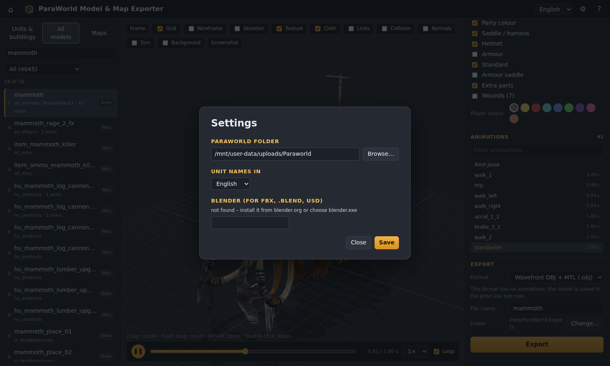
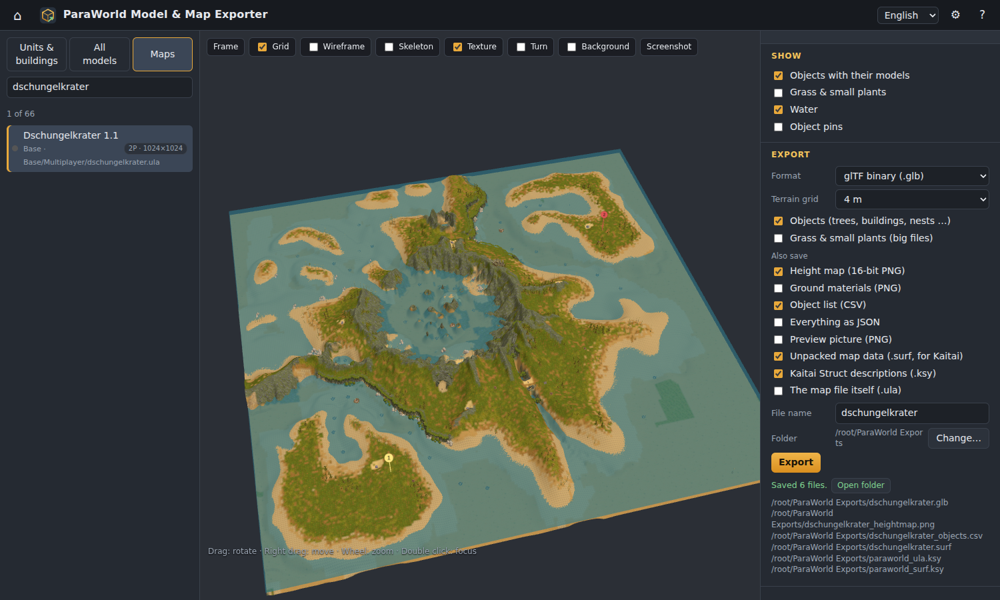

# Model & Map Exporter

Part of the [ParaWorld Toolkit](../README.md). Browse every unit, building and animal of the game in 3D, put on its
riders, turrets, build-ups and weapons, play its animations, and save it as **GLB, glTF, OBJ, Collada, STL, PLY** –
or **FBX, .blend, USD and Alembic** when Blender is installed.



* Reads the models straight from **your own ParaWorld installation** (nothing is downloaded, nothing is uploaded).
* **Unit / building explorer** with filters by faction and type, and a search that finds English *and* German
  names (and every other language your game has).
* **Add-ons** the way the game puts them together: riders and gunners, turrets, build-ups, drawbars and wagons,
  level flags, weapons by unit level, worker tools, carried goods – each one can be switched on and off.
* **Model parts**: saddles, armour, helmets, wounds, construction stages, damage stages, epoch variants, night
  lights – and the player colour.
* **Animations** play on the model, add-ons included (the rider keeps riding while the mount walks).
* **Exports** keep textures, skeletons and animations (GLB/glTF/FBX), or a posed static mesh (OBJ/STL/PLY/DAE).
* **Map viewer**: every map of your installation in 3D – terrain with the original ground textures, the sea, every
  tree, rock, nest and building – exported as a 3D file, height map, object list or raw data with
  [Kaitai Struct](https://kaitai.io) descriptions of the map format.
* English and German user interface. Runs on Windows, Linux and macOS.

---

## Contents

1. [Installation](#1-installation)
2. [Tutorial](#2-tutorial)
3. [Maps](#3-maps)
4. [Examples](#4-examples)
5. [Export formats](#5-export-formats)
6. [Command line](#6-command-line)
7. [Tips and troubleshooting](#7-tips-and-troubleshooting)
8. [For developers](#8-for-developers)
9. [Credits and license](#9-credits-and-license)

---

## 1. Installation

The exporter comes with the toolkit: start **`Start ParaWorld Toolkit.bat`** (Linux/macOS: `./start.sh`), tell the
launcher where ParaWorld is installed, and press **Open** on the *Model & Map Exporter* card. See the
[toolkit README](../README.md#quick-start) for Python and the first start.

Optional: **Blender** (<https://www.blender.org>, free) for FBX, `.blend`, USD and Alembic files. The tool finds a
normal Blender installation by itself; otherwise set the path to `blender.exe` in the settings.

The exporter also runs on its own: `python -m pwexport` (same settings, its own start screen).

## 2. Tutorial

### Step 1 – First start: language and game folder


* The launcher asks once where ParaWorld is installed: the folder that contains the `Data` folder. Found
  installations are listed below the field – click one – or press **Browse…**.
* The very first start reads the table of contents of every model archive once (10–30 seconds); after that the
  exporter opens instantly. The **⌂** button in the exporter's title bar goes back to the launcher.
* The language drop-down switches the tool between English and German; the **⚙ settings** pick the language of the
  unit names (every language your game has).

### Step 2 – Find a unit or building



The list on the left holds every unit, animal, vehicle, ship, hero and building of the four tribes and the wildlife.

* **Search** by name or by internal id. The search knows the English and the German names, so *Axtkrieger* and
  *Warrior* both find `hu_warrior`.
* **Faction chips**: Norsemen, Dustriders, Dragon Clan, SEAS, Wildlife, Heroes & special.
* **Type chips**: Characters, Animals, Vehicles, Ships, Buildings.
* Click an entry to load it. The model is converted the first time you open it (a second or two) and comes from the
  cache afterwards.

**The 3D view**: drag to rotate, right-drag to move, mouse wheel to zoom, double-click a spot to orbit around it.
The toolbar has **Frame** (fit the model), grid, wireframe, skeleton, turntable, a light background and
**Screenshot** (saves a PNG of the view).

### Step 3 – Add-ons: riders, turrets, build-ups, weapons



The **Add-ons** section lists every part the game scripts attach to the selected object, grouped as riders & crew,
turrets, build-ups, drawbar/wagon, weapons, worker tools, carried goods and other parts (level flags, cranes …).
Hover an entry to see when the game shows it (*"after upgrade …", "while chopping wood", "unit level ≥ 3"*) and the
attachment point it hangs on (`@Ride`, `@HndR` = right hand, `@we` = weapon mount …).

* Tick a part to show it, untick to hide it. Only one part fits on an attachment point, so ticking a second
  weapon for the same hand replaces the first.
* Parts with **variants** have a drop-down: rider models per level, the five level flags, the collector wagon per
  epoch, random weapon variants (`hu_axe_a`, `hu_axe_a_2`, `hu_axe_a_3`).
* **Build-ups** that exclude each other (the Brachiosaurus can carry a mobile camp, a catapult, a transporter or a
  siege tower) switch the matching rider seat and flag along, like in the game.
* The **Level** selector (1–5) picks the level model of the unit, the matching rider and flag, and the best weapon
  the unit carries at that level.
* Some parts need another look of the building: ticking the ballista of the *Large tower* switches to the upgraded
  *Ballista tower* model automatically.



### Step 4 – Model parts and player colour

Every model also carries parts that the game switches on and off:

| Object | Toggles |
|---|---|
| Animals and vehicles | saddle / harness, armour, helmet, standard, party-colour cloth, wounds |
| Buildings | construction stage (foundation → finished), condition (intact / damaged / badly damaged), epoch I–V, night lights |
| Everything | helper meshes (shadow and selection volumes – hidden by default), effect sprites (smoke, dust) |

**Player colour** tints the party-colour parts (banners, cloth, shields) with one of the eight colours of the game.
The grey swatch shows the untinted texture.

### View toggles

The bar above the view: **Frame** (fit the model into the view), **Grid**, **Wireframe**, **Skeleton** (the bones),
**Texture** (off: plain material colours), **Cloth** (the cloth parts: flags, banners, sails, paddle flaps – switched
off they are left out of exports too), **Links** (the attachment points with their names: `Ride` riders, `we`
turrets, `Bl_0..9` builders, `flag`, `D_01..16` damage effects …), **Collision** (the pathfinder boxes and spheres in
yellow, the selection volumes in orange), **Normals** (the vertex normals), **Turn**, **Background** and
**Screenshot**. On maps only Frame, Grid, Wireframe, Texture and the last three are offered.

### Step 5 – Animations



* The **Animations** list shows every animation of the model with its length. Click one to play it; type into the
  filter to find one quickly (`walk`, `attack`, `die` …). *Rest pose* stops the animation.
* The player bar under the view: pause/play, scrub through the animation, speed (¼× – 2×), loop.
* **Seamless walk loop** (shown for walk animations made as *start → loop → stop*, like the Black widow's): plays only
  the looping middle part, as the game does.
* Below the list, every add-on with animations has its own drop-down: what the rider, gunner or turret plays.

### Step 6 – Export



1. Pick a **Format** (see [Export formats](#5-export-formats)).
2. For animated formats choose **All animations**, **Only the playing one** or **None**. Static formats save the
   model in the pose you see at that moment – pause on the frame you want.
3. Check the **File name** and the **Folder** (default: `ParaWorld Exports` in your user folder; **Change…** picks
   another one).
4. Press **Export**. The tool writes the file(s) and shows **Open folder**.

What you see is what you get: the add-ons, the parts you switched off, the player colour and the add-on animations
are all part of the exported file.

### Step 7 – All models



The **All models** tab lists every one of the ~4000 models in every archive – decorations, trees, rocks, ruins,
effects, campaign buildings, single weapons and tools. Filter by archive and search by file name. Selecting one shows
it on its own, with its parts, animations and the same export options.

### Settings



**⚙** in the top right: the game folder, the language of the unit names (every language your game has), and the
path to Blender. The language drop-down next to it switches the tool between English and German.

## 3. Maps


The **Maps** tab lists every map of your installation (`Data\<pack>\Maps\**\*.ula`: the multiplayer and
campaign maps of the game, the booster packs, and the maps you installed yourself) with its name, players and size.

Click one to load it:

* **The 3D view** shows the terrain with the setting's original ground materials (blended like the game does), the
  sea at its water level and every placed object with its model – trees, stones, fruit bushes, nests, ruins,
  buildings. Start locations stand out as numbered poles in the player colours. Drag, right-drag and wheel as in the
  model view; **Frame** brings back the overview.
* **The panel** shows the map's preview picture, size, setting, water level, players, author and description, and how
  many objects of each kind it holds.
* **Show**: objects with their models, grass & small plants (the landscape decoration – many thousands), water, and
  pins for every object (handy for objects without a model in your installation).
* **Walls** are joined like in the game: every wall piece shows only the arms towards its neighbouring pieces, towers
  and gates (and one of the model's variants per arm) – in the 3D view and in the map exports.

### Exporting a map



| Option | What you get |
|---|---|
| **3D file** (GLB, glTF, OBJ, Collada, STL, PLY) | the terrain (textured with one baked texture of the whole map), the sea, and – if ticked – every object with its model. Y is up, metres, the origin in the centre of the map. *Terrain grid* sets the detail: 2 m is the game's own resolution. |
| **Height map** | 16-bit greyscale PNG, 1 pixel = 2 m, black = 0 m, white = the highest point (the file name says nothing about the scale; the JSON export has `w`, `h` and the heights) |
| **Ground materials** | 8-bit PNG, 1 pixel = 4 m, value = material index × 32 |
| **Object list** | CSV: type, name, class, model, position, heading, owner and every attribute (hit points = resource amount, nest spawn settings …) |
| **Everything as JSON** | level info, player slots, description, objects, plants |
| **Preview picture** | the 200 × 200 picture the game shows in the map list |
| **Unpacked map data (.surf)** + **Kaitai Struct descriptions** | the raw map data and the formal description of it, see below |
| **The map file itself** | a copy of the `.ula` |

### The map format and Kaitai Struct

`.ula` files are a zlib-compressed tree of chunks. The toolkit ships formal descriptions of the format in the
[Kaitai Struct](https://kaitai.io) language – [`paraworld_ula.ksy`](../pwexport/data/ksy/paraworld_ula.ksy) (the
container) and [`paraworld_surf.ksy`](../pwexport/data/ksy/paraworld_surf.ksy) (the unpacked map: level info with
the preview picture and the editor's description, terrain heights and materials, every placed object with its class,
model, position and attributes, the landscape decoration). They are checked against all 66 maps of the game.

To explore a map in the [Kaitai Web IDE](https://ide.kaitai.io): export it with **Unpacked map data (.surf)** and
**Kaitai Struct descriptions**, drop both `.ksy` files and the `.surf` into the IDE and open `paraworld_surf.ksy`.
(Kaitai cannot join the compressed blocks of a `.ula` itself; `paraworld_ula.ksy` parses the container and, for maps
small enough to fit into one block, the map data directly.) Use the descriptions to generate a parser for your own
program in C++, C#, Java, JavaScript, Python, Rust and more with `kaitai-struct-compiler`.

The same from the command line:

```
python -m pwexport.ula info "C:\Games\ParaWorld\Data\Base\Maps\Base\Multiplayer\berg.ula"
python -m pwexport.ula unpack berg.ula berg.surf        # for Kaitai
python -m pwexport.ula pack berg.surf berg_copy.ula      # and back
python -m pwexport.ula objects berg.ula > objects.json
python tools/ksy_check.py pwexport/data/ksy/paraworld_surf.ksy berg.surf   # check the .ksy against a file
```

The format notes in prose: [MAP_FORMAT.md](MAP_FORMAT.md).

## 4. Examples

### Use a unit in Blender, with its animations

1. Select **Black widow** (`seas_wehrspinne`) – the turret and the gunner are on by default.
2. Format **glTF binary (.glb)**, animations **All animations**, **Export**.
3. In Blender: **File → Import → glTF 2.0** and pick the `.glb`. Each game animation becomes an *Action*: select the
   armature, open **Dope Sheet → Action Editor** and pick one. Set **Output Properties → Frame Rate** to 25 fps.

### A game engine (Unity, Unreal, Godot)

Godot and Unity (with glTFast) read `.glb` directly. For Unreal or the classic Unity importer, install Blender and
export **FBX** – the tool hands the model to Blender in the background, so the result still has the skeleton,
skinning and every animation.

### 3D printing

1. Select a unit, switch off the parts you don't want (wounds, effect sprites) and pick a pose: play an
   animation, pause on the frame you like.
2. Format **STL** and **Export**. The STL is in the game's units (a warrior is about 4 units tall), Y up – scale
   it in your slicer.

### A whole tribe at once

```
python -m pwexport.cli export-all --tribe SEAS --format glb --out "SEAS models"
```

## 5. Export formats

| Format | Animations | Textures | Notes |
|---|---|---|---|
| **GLB** (glTF binary) | ✔ all / one / none | inside the file | the best all-round choice: Blender, Godot, Unity (glTFast), Babylon.js, three.js, online viewers |
| **glTF** + .bin + textures | ✔ | `<name>_textures` folder | the same as GLB, as readable separate files |
| **OBJ** + MTL | – (posed) | `<name>_textures` folder | for any 3D program; one object per part, materials with textures |
| **Collada** (.dae) | – (posed) | `<name>_textures` folder | older programs and engines |
| **STL** | – (posed) | – | 3D printing |
| **PLY** | – (posed) | – (UVs kept) | MeshLab, CloudCompare, point-cloud tools |
| **FBX** *(Blender)* | ✔ | embedded | Unreal, Unity, 3ds Max, Maya |
| **.blend** *(Blender)* | ✔ | packed | opens directly in Blender |
| **USD** *(Blender)* | ✔ | | Omniverse, Houdini, Apple tools |
| **Alembic** *(Blender)* | ✔ (baked) | | baked vertex animation for VFX tools |
| **Collada with animation** *(Blender 4.x)* | ✔ | | |

Animations run at 25 frames per second. GLB, glTF and the Blender formats keep the normal maps as well.

## 6. Command line

Everything the app does is also available for scripts (the install folder and language saved by the app are used,
or pass `--install` / `--lang`):

```
python -m pwexport.cli list --tribe Hu --type ANML                      # what is there
python -m pwexport.cli export hu_triceratops --format glb --out exports  # a unit with its default add-ons
python -m pwexport.cli export hu_warrior --level 3 --format obj --anim walk_3 --time 0.4 --out exports
python -m pwexport.cli export-model allosaurus --format glb --out exports  # one model file, no add-ons
python -m pwexport.cli export-all --type BLDG --format obj --out buildings
python -m pwexport.gsf "C:\Games\ParaWorld\Data\Base\GSF\all_animals.gsf" -o raw_glb   # raw archive conversion
```

`python -m pwexport --port 8420 --no-browser` starts the exporter alone without opening a browser.

## 7. Tips and troubleshooting

* **Nothing happens when I double-click the .bat** – open a command prompt in the toolkit folder and run
  `py -3 -m toolkit` to see the message. Usually Python is missing or not on the PATH.
* **"This folder does not look like a ParaWorld installation"** – pick the folder that contains `Data` (or `Data`
  itself) and check that `Data\Base\GSF` exists.
* **FBX is greyed out** – Blender was not found. Install it or set the path to `blender.exe` in the settings.
* **The model is dark / pink in another program** – keep the `_textures` folder next to OBJ / glTF files, or use
  GLB, which carries its textures inside.
* **Disk space** – converted models are cached in `%APPDATA%\ParaWorldToolkit\cache` (Linux/macOS:
  `~/.config/paraworld-toolkit/cache`). Delete the folder any time; it is rebuilt when needed. Set the
  environment variable `PWTOOLKIT_HOME` to keep settings and cache somewhere else (e.g. on a USB stick).
* **Mods** – models of BoosterPack 1/3 and mods in `Data\<mod>\GSF` (MIRAGE, Wintermod …) appear under *All models*;
  a mod's archive replaces the Base archive of the same name.

## 8. For developers

The tool is one Python package, `pwexport`, plus a small web page. It is also **the extraction library of the
ParaWorld remake**: the remake's asset and data pipeline (`remake/pipeline/`) imports these modules, so a fix here
reaches both. When you change what the
converter writes, bump `VERSION` in `pwexport/gsf.py`: that invalidates the cached conversions.

| Module | What it does |
|---|---|
| `gsf.py` | GSF archives → glTF 2.0: meshes, textures (DDS → PNG), skeletons, skin weights, attachment points, animations, walk sets, sound events. `Archive(path).export(name, out)`; command line `python -m pwexport.gsf` |
| `glb.py` | read / write `.glb`, trim animations, find seamless walk loops, list links |
| `tree.py` | parser of the game's text data (tech tree `.ttree`, class / settings `.txt`) |
| `install.py` | finding the installation, mods, locales; case-insensitive paths |
| `gamedata.py` | tech tree, class files, the models an object can show (levels, upgrades) |
| `texts.py` | display names and descriptions in every language of the game |
| `composites.py` + `data/composites.json` | how the scripts assemble multi-part objects (datamined, see `docs/COMPOSITES.md`; regenerate with `tools/datamine/`) |
| `catalog.py` | model index (model → archive, cached) and the unit/building catalog with add-ons |
| `parts.py` / `web/parts.js` | which parts of a model show (GSF attribute flags) |
| `scene.py` | put a model and its add-ons together into one glTF scene; pose it |
| `writers.py` | GLB, glTF, OBJ, Collada, STL, PLY writers |
| `blender.py` | FBX / .blend / USD / Alembic through Blender in the background |
| `app.py`, `web/` | the local server and the browser UI (three.js) |
| `ula.py` | map files: reader (level info, preview, terrain, objects, plants), unpack / pack, command line |
| `scape.py` | the 8 ground materials of every setting (from the scape atlases); a baked texture of a whole map |
| `mapexport.py` | maps → 3D files (terrain, sea, objects), height map, material map, CSV, JSON |
| `data/ksy/*.ksy` | Kaitai Struct descriptions of the map format |
| `cli.py` | command line export |

```python
from pwexport.install import Install
from pwexport.catalog import ModelIndex, Catalog
from pwexport.texts import Texts
from pwexport import scene, writers

game = Install(r'C:\Games\ParaWorld')
idx = ModelIndex(game)
cat = Catalog(game, idx, Texts(game, 'de'))
widow = cat.entry('seas_wehrspinne')
sc = scene.compose([
    {'glb': idx.convert('seas_wehrspinne')},
    {'glb': idx.convert('seas_wehrspinne_top'), 'parent': 0, 'link': 'we'},
    {'glb': idx.convert('seas_rider_b'), 'parent': 1, 'link': 'Dri1', 'anim': 'balista_stand'},
], animations=['walk_1'])
writers.write(sc, 'out/black_widow', 'glb')
```

The format of the GSF files is described in [GSF_FORMAT.md](GSF_FORMAT.md), the maps in [MAP_FORMAT.md](MAP_FORMAT.md).
`tools/ui_test.py` runs the toolkit headless through a full session (launcher, add-ons, animations, exports, maps)
and takes the screenshots of this guide.

## 9. Credits and license

* The GSF format research this tool builds on: **Zidell** (the GSF documentation) and **arceusVen1**'s
  **[Paraworld_gsf_viewer](https://github.com/arceusVen1/Paraworld_gsf_viewer)** – thank you!
* 3D view: [three.js](https://threejs.org) (MIT license, included in `pwexport/web/vendor/three`); [Kaitai Struct](https://kaitai.io) for the map format language.
* ParaWorld © SEK / Sunflowers / Ubisoft. The tool only reads the files of your own copy of the game; the models,
  textures and texts stay the property of their owners – share exported models with that in mind.

**License: [The Unlicense](../LICENSE)** – this tool is public domain. Use it, change it, copy it, sell it, put it in
your own project, with or without credit. No conditions.
