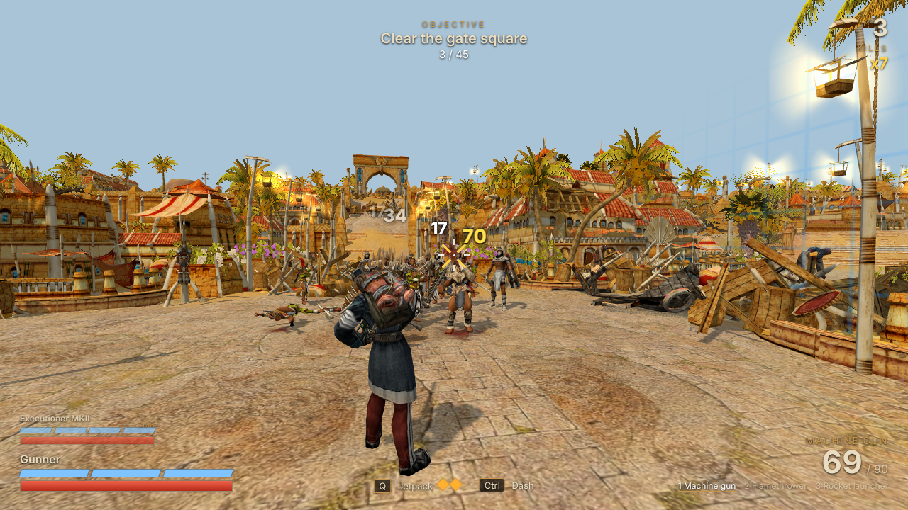
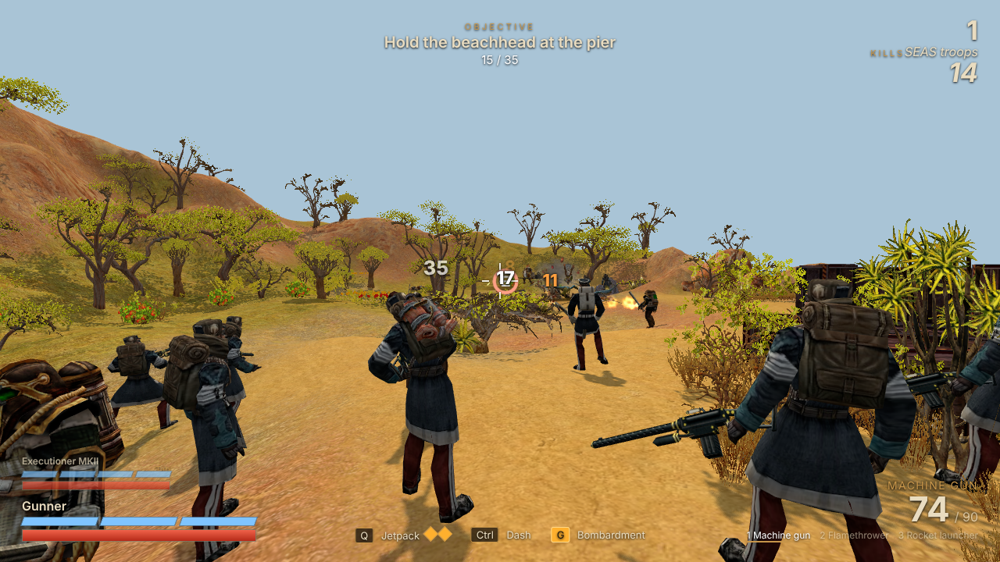
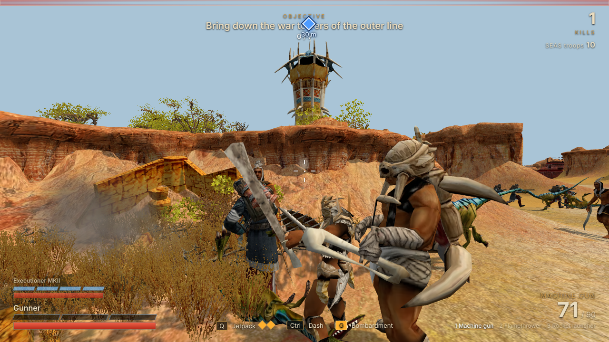
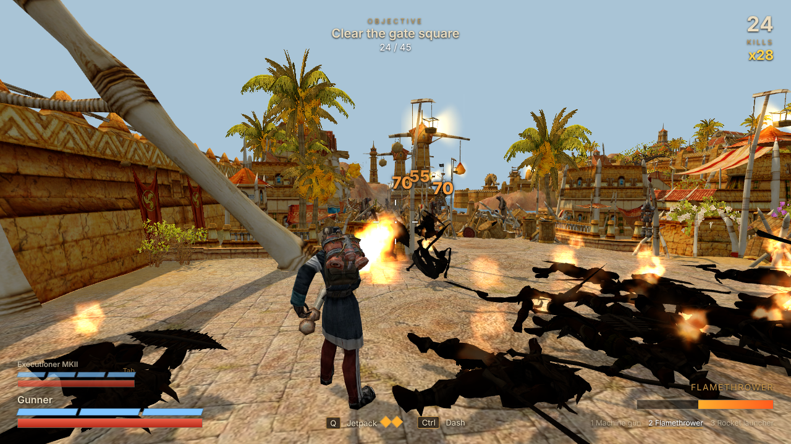
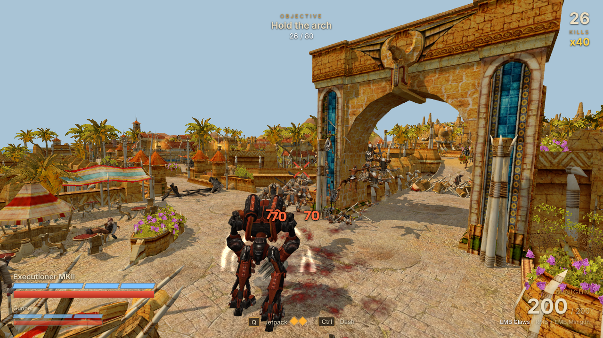
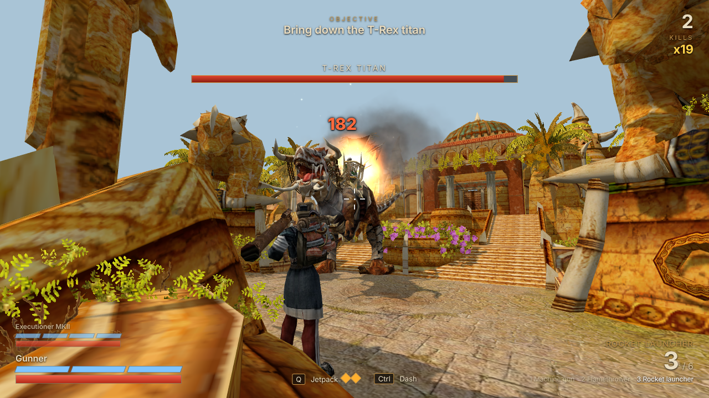
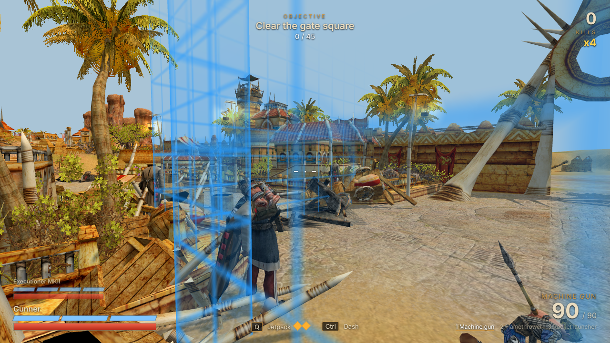

# ParaWorld Shooter

A third-person action game made with the models, maps, animations and sounds of your own ParaWorld installation:
you fight against swarms of Dustriders as the SEAS **Gunner** or the **Executioner MKII**, and can swap between the
two at any time. Two missions: **The Holy City** (campaign mission 5: alone through the ruined city) and **The
Assault** (a full SEAS attack on the city, with troops at your side).



Nothing of the game is stored here. The shooter uses the game data the ParaWorld Toolkit prepares for the remake
(converted models, textures, ground textures) and reads maps and sounds straight from the game folder.

## Start

1. Start the ParaWorld Toolkit once, choose the game folder and press **Prepare the game data** in the Remake card
   (only needed the first time, or after the toolkit asks for it again).
2. Double-click **Start ParaWorld Shooter.bat** in the toolkit folder (or run `python -m shooter`).
   The game opens in the browser at http://127.0.0.1:8430/ - use Chrome or Edge.
3. Choose the mission, pick who goes in first and play. Close the black window to stop the game's server.

`python -m shooter --help` lists the options (`--port`, `--game <ParaWorld folder>`, `--data <prepared data>`,
`--no-browser`).

## The missions

### The Holy City

The whole city is the battlefield, one district after the other: the Dustrider camp before the walls, the gate
square, the harbour, the lower city, the western terrace, the triumphal arch, the eastern quarter, the fountain
plaza and the temple forecourt. Seventeen objectives lead through them: burn the war camp, sink the canoes at the
pier, topple the skull totems, hold the terrace for a minute, hunt down the Allosaurus riders, burn the chieftains'
tents, and at the end the T-Rex titan.

A district that is not open yet is shut off: rubble lies across its streets and a faint energy wall shows where
the border is (it also stops a jetpack jump). When the objective that opens it starts, the rubble is blown away.
The Dustriders are not held back - they come over the barricades.

### The Assault

Played on **"Holy City defender"** (SEK & DryFun), a fan-made map that comes with the **MIRAGE** mod
(`Data/MIRAGE/Maps/Multiplayer/holy_city_defender.ula`; without it the mission is greyed out). It is the Holy City
whole again and garrisoned, with the country north of it: a SEAS pier where two carriers lie, the savanna, a line of
Dustrider war towers and clay walls across the roads, and the city gate.

This time you are one of many. SEAS troops land with you and keep coming - riflemen, marksmen, rocket men,
flamethrowers and mechanical walkers. They go where the fight is (a little ahead of you towards the objective),
shoot what they see, are hunted by the Dustriders just like you, and fall; every few seconds a fresh group arrives
from behind. They hold a line for a while but do not win it: the front moves when you push. Nothing you do can hurt
them. The number of your own kills and of the troops alive is at the top right.

Twenty-five objectives: hold the beachhead at the pier, burn the siege camp before the SEAS fort (the fort then
becomes the base of the assault: buildings go up inside its walls), kill the
Stegosaurus rider in the pass, hold the crossroads until the Black Widows have come up (three siege spiders arrive
through the pass - never more than three at a time, a lost one is replaced with the next wave; they go ahead, curl
up and shell the towers first; from here on the Dustriders only come from the city side), storm the war towers of
the outer line (they shoot back, and Ankylosaurus catapults stand among them), break the bone gates of the clay
walls (they cannot be forced while the towers stand), kill the Allosaurus riders that sally from the city, cover the sappers until the
gate blows - and then the city, district by district (Exo enforcers join your waves, Stegosaurus riders theirs;
in the upper city Brachiosaurus catapults that throw rocks and stamp): the gate square, the fleet in the harbour
(transport turtles and war catamarans, which shoot back), the towers of
the lower city, the terrace, the arch, the eastern quarter, the Heart of the City on the fountain plaza, and the
T-Rex titan before the temple. The towers of the city shoot at whoever is near until they are torn down.

| | |
|---|---|
|  |  |

### In both

**Checkpoints.** Each mission has two: in The Holy City at "Break into the lower city" and "On to the triumphal
arch", in The Assault when the gate is down ("into the city") and at "On to the triumphal arch". Reaching one is
remembered. If both characters fall, the end screen offers **Continue from the checkpoint**: the mission starts
again at that objective with the districts won so far open, what you destroyed gone, and both characters fresh.
The checkpoint is kept in the browser, so the start screen offers it the next time too; starting from the
beginning discards it.

When one of your two characters falls the other is in at once. The destroyed Executioner stays where it fell,
folds down and then blows up: huge damage to every enemy around it, none to the Gunner. The enemies only cheer
when both are down.

Deep water stops you like a wall (you wade in knee-deep); a jetpack jump may cross it.

What the models show is the game's own: buildings and towers go through their damage stages as they are shot up,
ridden animals wear saddle and harness and show wounds, walls show only the arms towards their neighbours.

A swarm cannot kill you in an instant (`protect` in `config.js`): only so much damage gets through per second
however many strike, one hit never breaks more than one armour segment and never goes through the armour, a broken
armour gives a moment of immunity, and a blow that would kill you from above a quarter of your health leaves you
at 1 with a second to get away ("last stand").

| | |
|---|---|
|  |  |
|  |  |

## Controls

| key | action |
|---|---|
| W A S D, mouse | move, aim |
| left mouse button | Gunner: fire. Executioner: claw combo |
| right mouse button | Gunner: aim down the sights. Executioner: raise the minigun - the left button then fires it |
| 1 2 3, mouse wheel | change weapon (Gunner) |
| Tab | swap Gunner / Executioner MKII |
| Q | jetpack jump (press F in the air: dive into the ground) |
| Space, Shift, Ctrl (or C) | jump, sprint, dash. Nothing hurts you during a dash; the Executioner's lasts a full second (27 units, four times the Gunner's) and rams: every enemy in the way is hit and thrown aside |
| F | knife (Gunner) |
| E | execute a reeling enemy (red "E" ring): restores a segment of armour |
| G | Gunner: **Bombardment** - for 4 seconds bombs come down all around you (within 44 units, most of them on enemies; you can keep moving, it follows you). Hurts enemies only - not you, not your troops. Once a minute |
| R | reload |
| V, X | first / third person, camera over the other shoulder |
| Esc | pause, settings |

Every hit shows the damage it did as a number over the enemy (white; yellow for a head shot, orange for fire,
large for a heavy blow; a burst on one enemy adds up to one number). "Damage numbers" in the settings switches them off.

Bullets carry about 100 units (minigun 85) and a rocket goes off by itself after 130 - towers cannot be picked off
from beyond their own reach.

**Gunner** - machine gun, flamethrower, rocket launcher. **Executioner MKII** - claws (three-hit combo, each swing
cleaves everything in front) or minigun (pierces one enemy). Armour (blue) soaks up damage first; it only comes
back slowly on its own, but at once by executing enemies. Health (red) returns after every completed objective,
and a fallen character comes back then. If both fall, the mission is lost.

## How it is built

Plain browser code, no build step: edit a file below `shooter/web/src`, reload the page.

```
shooter/
  server.py            local web server: game code, three.js (the exporter's copy), prepared data, maps, sounds
  web/index.html, style.css
  web/src/main.js      start-up, frame loop, glue
  web/src/game/
    config.js          EVERY number worth tuning: characters, weapons, enemies, the mission, look, difficulty
    level.js           the map as a level: ground, city, water, what is solid
    collision.js       triangle soup + terrain: ground height, walls, rays
    nav.js             where the swarm can walk, and the flow field that leads it to the player
    player.js          movement, jetpack, weapons, claws, executions, damage, camera
    actors.js          model instances, attachment points, legs / upper-body animation
    enemies.js         the swarm's state machines, queries (rays, cones, radius)
    projectiles.js     rockets, spears, arrows
    missions.js        the list of missions; mission_assault.js: the second one (map, districts, objectives)
    mission.js         objectives (reach, kill, hold, destroy, boss), the garrison and the spawn director
    allies.js          the SEAS troops at the player's side (The Assault)
    zones.js           the districts: which is open, the border wall, the rubble in the gaps
    log.js             the session log
    fx.js              particles (the game's own particle textures), tracers, decals, camera shake
    hud.js, input.js, engine.js
  web/src/pw/          files shared with the remake (map reader, terrain shader, model loader, audio) - see pw/README.md
  tests/               headless checks (need Node, Playwright and a Chromium): shot.mjs, shots.mjs, bot.js,
                       route.js, playthrough.js, stuck.js, spin.js, aim.js, loop.js, wall.js, dash.js, blast.js, protect.js, targets.js, claws.js, numbers.js, allies.js, ultimate.js, checkpoint.js, range.js, water.js,
                       zones.js + zones_map.py (draws the districts)
  docs/DESIGN.md       how the parts work and why
```

Units: ParaWorld's own ("u"): a soldier is about 4 u tall. See the top of `config.js`.

## If the game crashes or the window closes

Everything the game does is written to a log file while it runs:
`%APPDATA%\ParaWorldToolkit\shooter\logs\shooter-<date>-<time>-<session>.log` (the black server window, the pause
screen and the start screen show the exact path). It holds the start (browser, graphics card, settings), every
objective and boss, every error with the state of the game, and a line of numbers every 5 seconds (position, health,
enemies, frames per second, worst frame, memory). How it ends tells what happened:

* `PAGE CLOSED ... keys held: ...` - the browser closed or reloaded the page in an orderly way (a shortcut such as
  Ctrl+W, the close button, Alt+F4). The dash is on Ctrl, so dashing while running forward is Ctrl+W, the browser's
  "close tab" - a web page cannot switch that off, but the game asks before leaving a running mission: answer
  "Cancel" / "Stay". C dashes too, without that.
* `SERVER !! nothing heard from the game page for 30 s` with no PAGE CLOSED before it - the browser crashed, froze or
  was killed; the last `BEAT` lines show what was going on (memory, frame times, `GPU !! WebGL context LOST`).
* `ERROR` / `CONSOLE` lines - a bug in the game; the text is the place in the code.
* `GPU !! WebGL context LOST` - the graphics driver reset the game's 3D context (a white or black picture; the page
  now says so and offers to start again). The `WARM` line after `LOADED` and `worst frame` in the `BEAT` lines show
  whether one frame took too long.

After a session that did not close normally the start screen points to its log. `?nolog` in the address switches
the log off. The newest 30 files are kept.
